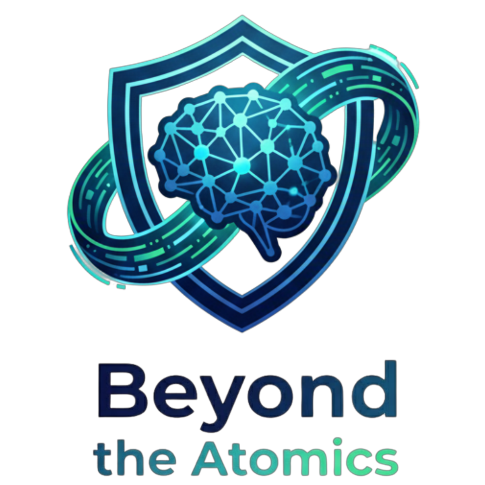

<div align="center">
  
  <h1>Beyond the Atomics</h1>
  <p><strong>A Next-Generation AI-Driven BAS (Breach and Attack Simulation) Framework</strong></p>
</div>

## Overview

**Beyond the Atomics** is an advanced, AI-orchestrated Breach and Attack Simulation framework designed to automate the evaluation of organizational security posture. Moving beyond simple static execution, it utilizes large language models (like Phi-3 via Ollama) and real-time Threat Intelligence (CTI) to dynamically map, stage, and execute MITRE ATT&CK techniques, verifying defenses (like Wazuh SIEM) across distributed Windows and Linux agents.

## Features

- 🧠 **AI-Orchestrated Autopilot:** Uses local AI models (via Ollama) to dynamically analyze target environments, resolve dependencies, and map threat intelligence to executable TTPs.
- 📡 **CTI Integration:** Automatically fetches and correlates threat intelligence pulses from sources like AlienVault OTX to ensure tests reflect the current threat landscape.
- 🎯 **Cross-Platform Distributed Agents:** Lightweight PowerShell and Bash agents allow remote execution and reconnaissance on Windows and Linux targets.
- 📦 **Pre-Flight Payload Delivery:** Autonomously discovers, hosts, and safely transfers prerequisite files (malware payloads, tools) directly to agents, bypassing dependency errors.
- 🛡️ **SIEM Validation Engine:** Natively integrates with Wazuh to empirically verify whether an executed technique was successfully detected and logged.
- 🧹 **Strict OpSec Cleanup:** Guarantees artifact removal post-execution to keep target environments clean.
- 📊 **Telemetry & Scoreboarding:** Provides deep, granular analytics, AI DFIR reasoning per test, and aggregate posture scoring across the enterprise.

## Prerequisites

- **Python 3.10+**
- **Wazuh SIEM** (Optional but highly recommended for detection validation)
- **Ollama** (Running locally with the `phi3` or similar model for the AI Orchestrator)
- **AlienVault OTX API Key** (For Threat Intelligence sync)

## Installation & Setup

1. **Clone the repository:**
   ```bash
   git clone https://github.com/abubker99/Beyond-the-atomics.git
   cd beyond-the-atomics
   ```

2. **Set up a Virtual Environment:**
   ```bash
   python -m venv venv
   source venv/bin/activate  # On Windows: venv\Scripts\activate
   ```

3. **Install Dependencies:**
   ```bash
   pip install -r requirements.txt
   ```

4. **Environment Configuration:**
   Copy `.env.example` to `.env` and fill in your secrets:
   ```bash
   cp .env.example .env
   ```
   *Note: Ensure `FLASK_SECRET_KEY` and `DB_ENCRYPTION_KEY` are long, random, and secure.*

5. **Initialize the Application:**
   ```bash
   python app.py
   ```
   *The application will automatically create the local SQLite databases and default admin account on first run.*

6. **Access the Dashboard:**
   Open your browser to `http://localhost:5000`
   - **Default Login:** `admin` / `admin` (Change this immediately upon login!)

## Agent Deployment

From the dashboard, navigate to the **Assets** section to find the one-liner deployment commands for your target operating systems. Agents poll the C2 server for reconnaissance tasks and scheduled TTP emulation jobs.

## Security & OpSec

- **No Hardcoded Secrets:** Configuration and keys are securely loaded from `.env` or the encrypted database.
- **Path Traversal Protection:** Payload delivery uses Flask's secure `send_from_directory`.
- **Cleanup:** Remote agents perform a rigorous recursive removal of the temporary staging folders after every execution.

## License

Distributed under the MIT License. See `LICENSE` for more information.
